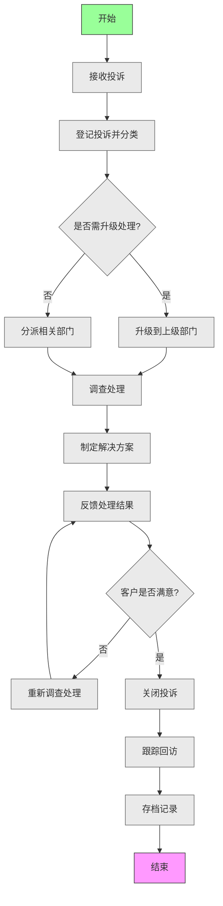

```mermaid
graph TD
    A[开始] --> B[接收投诉]
    B --> C[登记投诉并分类]
    C --> D{是否需升级处理?}
    D -- 是 --> E[升级到上级部门]
    D -- 否 --> F[分派相关部门]
    E --> G[调查处理]
    F --> G
    G --> H[制定解决方案]
    H --> I[反馈处理结果]
    I --> J{客户是否满意?}
    J -- 否 --> K[重新调查处理]
    J -- 是 --> L[关闭投诉]
    K --> I
    L --> M[跟踪回访]
    M --> N[存档记录]
    N --> O[结束]

    style A fill:#9f9,stroke:#333
    style O fill:#f9f,stroke:#333
    classDef default fill:#eaeaea,stroke:#666 
```