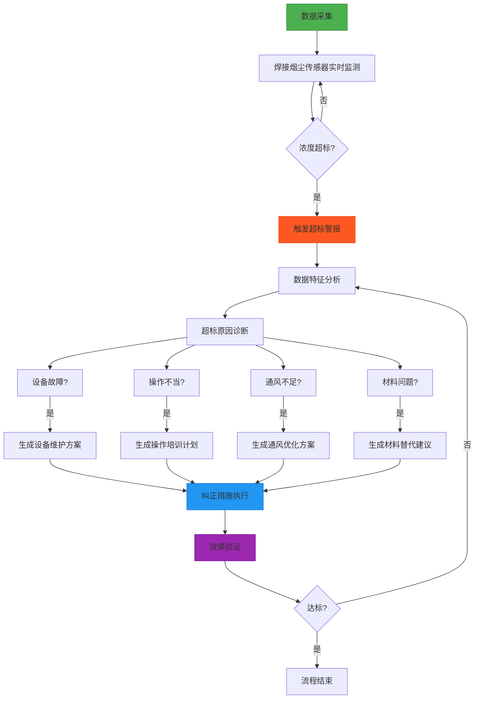

```mermaid
graph TD
    A[数据采集] --> B[焊接烟尘传感器实时监测]
    B --> C{浓度超标?}
    C -- 是 --> D[触发超标警报]
    C -- 否 --> B
    D --> E[数据特征分析]
    E --> F[超标原因诊断]
    F --> G[设备故障?]
    F --> H[操作不当?]
    F --> I[通风不足?]
    F --> J[材料问题?]
    G -- 是 --> K[生成设备维护方案]
    H -- 是 --> L[生成操作培训计划]
    I -- 是 --> M[生成通风优化方案]
    J -- 是 --> N[生成材料替代建议]
    K --> O[纠正措施执行]
    L --> O
    M --> O
    N --> O
    O --> P[效果验证]
    P --> Q{达标?}
    Q -- 是 --> R[流程结束]
    Q -- 否 --> E
    style A fill:#4CAF50,stroke:#388E3C
    style D fill:#FF5722,stroke:#E64A19
    style O fill:#2196F3,stroke:#1976D2
    style P fill:#9C27B0,stroke:#7B1FA2
```